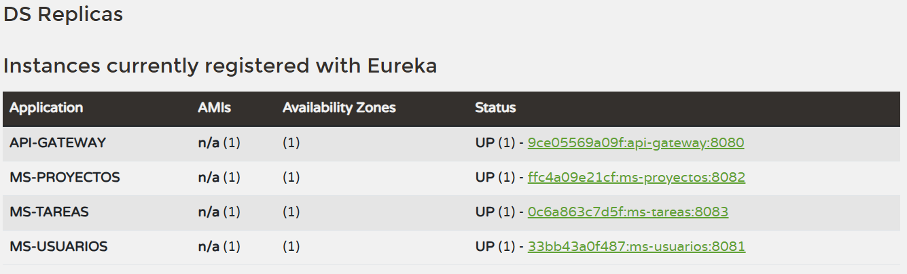
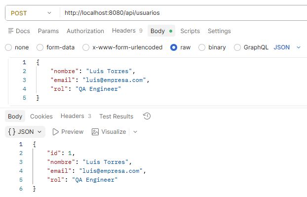
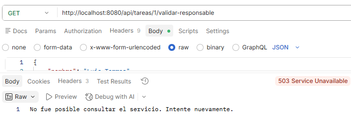

# MÓDULO 3 – SISTEMA DE GESTIÓN DE PROYECTOS
Este repositorio contiene la solución completa para el sistema de gestión de proyectos académico, desarrollado bajo una arquitectura orientada a microservicios utilizando el ecosistema de **Spring Boot 3.x**, **Spring Cloud** y **Java 17**.

La infraestructura completa se encuentra totalmente contenedorizada mediante **Docker** y **Docker Compose**.

---

## 🛠️ Arquitectura y Componentes del Sistema

El sistema se compone de los siguientes módulos estructurados en este Monorepo:

1. **`config-repo`**: Repositorio local con las propiedades externalizadas de los microservicios.
2. **`config-server`** (Puerto `8888`): Servidor de configuración centralizada en modo nativo local.
3. **`eureka-server`** (Puerto `8761`): Servidor de descubrimiento y registro de servicios.
4. **`api-gateway`** (Puerto `8080`): Puerta de enlace y enrutador dinámico (`lb://`).
5. **`ms-usuarios`** (Puerto `8081`): CRUD de usuarios conectado a la base de datos `db_usuarios`.
6. **`ms-proyectos`** (Puerto `8082`): CRUD de proyectos conectado a la base de datos `db_proyectos`.
7. **`ms-tareas`** (Puerto `8083`): CRUD de tareas conectado a `db_tareas`. Consume de forma resiliente a `ms-usuarios` mediante `WebClient` balanceado y **Resilience4j**.

---

## 🚀 Instrucciones de Despliegue Local

Para levantar el ecosistema completo con un solo comando, asegúrate de tener Docker corriendo y ejecuta en la raíz del proyecto:

```bash
docker-compose up --build
```

*Nota: El archivo `docker-compose.yml` incluye healthchecks automáticos en las 3 instancias de MySQL para garantizar que los microservicios no inicien hasta que sus respectivas bases de datos estén listas para recibir conexiones.*

---

## 📸 Evidencias de Funcionamiento (Entregables)

### 1. Panel de Control de Eureka Server
Servicios correctamente registrados y sincronizados de manera dinámica.


### 2. Consumo de Endpoints vía API Gateway
Prueba de enrutamiento exitosa consumiendo las APIs del sistema unificado a través del puerto `8080`.


### 3. Prueba de Resiliencia (Circuit Breaker & Fallback)
Simulación de caída del servicio `ms-usuarios` (`docker stop ms-usuarios`) al intentar consultar una tarea que requiere validar información de usuario. El sistema responde correctamente con el mensaje controlado de contingencia.

* **Mensaje de Fallback Obtenido:** `"No fue posible consultar el servicio. Intente nuevamente."`
  

---

## 🧪 Pruebas Automatizadas
Se incluye el archivo `coleccion_postman.json` en la raíz. Puede ser importado directamente en Postman para probar el flujo completo de creación de usuarios, asignación de proyectos y validación de tareas con tolerancia a fallos.
